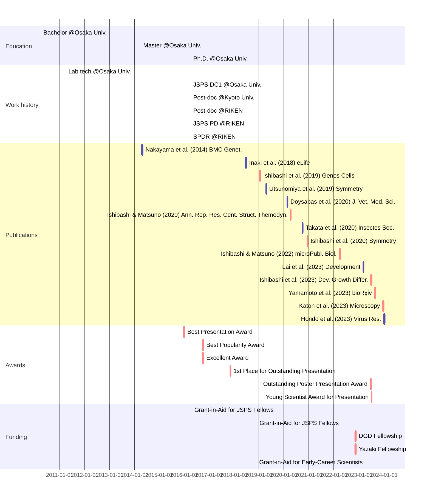

```mermaid
gantt
section Education
  Bachelor @Osaka Univ. : BS, 2010-04-01, 2014-03-25
  Master @Osaka Univ.   : MS, 2014-04-01, 2016-03-28
  Ph.D. @Osaka Univ.    : Ph.D., 2016-04-01, 2019-03-25
section Work history
  Lab tech.@Osaka Univ.     : done, OU-tech, 2011-04-01, 2012-03-31
  JSPS DC1 @Osaka Univ.     : done, DC1, 2016-04-01, 2019-03-31
  Post-doc @Kyoto Univ.     : done, KU-postdoc, after DC1, 2021-04-30
  Post-doc @RIKEN           : done, RIKEN-postdoc, after KU-postdoc, 2022-03-31
  JSPS PD @RIKEN            : done, PD, after RIKEN-postdoc, 2023-03-31
  SPDR @RIKEN               : active, SPDR, after PD, 2026-03-31
section Publications
  Nakayama et al. (2014) BMC Genet.           :       nakayama2014, 2014-04-16, 2w
  Inaki et al. (2018) eLife                   :       inaki2018, 2018-06-12, 2w
  Ishibashi et al. (2019) Genes Cells         : crit, ishibashi2019, 2019-01-09, 2w
  Utsunomiya et al. (2019) Symmetry           :       utsunomiya2019, 2019-04-08, 2w
  Doysabas et al. (2020) J. Vet. Med. Sci.    :       doysabas2020, 2020-02-12, 2w
  Ishibashi & Matsuno (2020) Ann. Rep. Res. Cent. Struct. Themodyn. : crit, ishibashi2020a, 2020-04-01, 2w
  Takata et al. (2020) Insectes Soc.          :       takata2020, 2020-09-22, 2w
  Ishibashi et al. (2020) Symmetry            : crit, ishibashi2020b, 2020-12-02, 2w
  Ishibashi & Matsuno (2022) microPubl. Biol. : crit, ishibashi2022, 2022-03-18, 2w
  Lai et al. (2023) Development               :       lai2023, 2023-03-02, 2w
  Ishibashi et al. (2023) Dev. Growth Differ. : crit, ishibashi2023, 2023-06-25, 2w
  Yamamoto et al. (2023) bioRχiv              : crit, yamamoto2023, 2023-08-16, 2w
  Katoh et al. (2023) Microscopy              : crit, katoh2023, 2023-12-15, 2w
  Hondo et al. (2023) Virus Res.              :       hondo2024, 2024-01-02, 2w
section Awards
  Best Presentation Award                  : crit, aw_1, 2015-12-20, 2w
  Best Popularity Award                    : crit, aw_2, 2016-09-25, 2w
  Excellent Award                          : crit, aw_3, 2016-09-25, 2w
  1st Place for Outstanding Presentation   : crit, aw_4, 2017-11-01, 2w
  Outstanding Poster Presentation Award    : crit, aw_5, 2023-06-15, 2w
  Young Scientist Award for Presentation   : crit, aw_6, 2023-06-29, 2w
section Funding
  Grant-in-Aid for JSPS Fellows             : done, grant_DC1, 2016-04-22, 2019-03-31
  Grant-in-Aid for JSPS Fellows             : active, grant_PD, 2022-04-22, 2025-03-31
  DGD Fellowship                            : crit, dgd_fellowship, 2022-11-04, 2w
  Yazaki Fellowship                         : crit, yazaki_fellowship, 2022-11-04, 2w
  Grant-in-Aid for Early-Career Scientists  : active, grant_ecs2023, 2023-04-01, 2026-03-31
```

