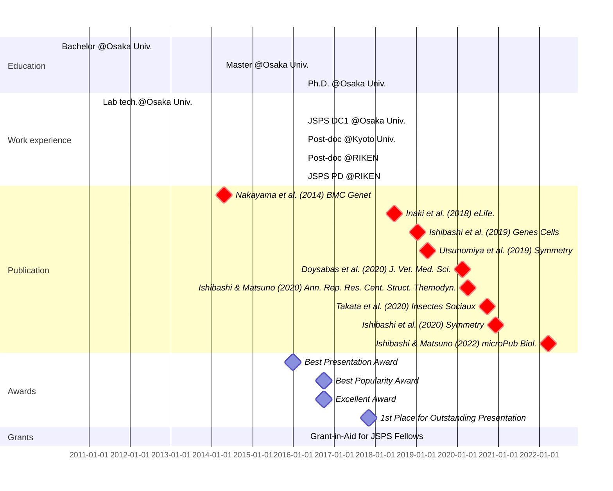

```mermaid
gantt
section Education
  Bachelor @Osaka Univ. : BS, 2010-04-01, 2014-03-25
  Master @Osaka Univ.   : MS, 2014-04-01, 2016-03-28
  Ph.D. @Osaka Univ.    : Ph.D., 2016-04-01, 2019-03-25
section Work experience
  Lab tech.@Osaka Univ.  : done, OU-tech, 2011-04-01, 2012-03-31
  JSPS DC1 @Osaka Univ.  : done, DC1, 2016-04-01, 2019-03-31
  Post-doc @Kyoto Univ.  : done, KU-postdoc, after DC1, 2021-04-30
  Post-doc @RIKEN        : done, RIKEN-postdoc, after KU-postdoc, 2022-03-31
  JSPS PD @RIKEN         : active, PD, after RIKEN-postdoc, 2025-03-31
section Publication
  Nakayama et al. (2014) BMC Genet          : crit, milestone, nakayama2014, 2014-04-16, 1w
  Inaki et al. (2018) eLife.                : crit, milestone, inaki2018, 2018-06-12, 1w
  Ishibashi et al. (2019) Genes Cells       : crit, milestone, ishibashi2019, 2019-01-09, 1w
  Utsunomiya et al. (2019) Symmetry         : crit, milestone, utsunomiya2019, 2019-04-08, 1w
  Doysabas et al. (2020) J. Vet. Med. Sci.  : crit, milestone, doysabas2020, 2020-02-12, 1w
  Ishibashi & Matsuno (2020) Ann. Rep. Res. Cent. Struct. Themodyn. : crit, milestone, ishibashi2020a, 2020-04-01, 1w
  Takata et al. (2020) Insectes Sociaux     : crit, milestone, takata2020, 2020-09-22, 1w
  Ishibashi et al. (2020) Symmetry          : crit, milestone, ishibashi2020b, 2020-12-02, 1w
  Ishibashi & Matsuno (2022) microPub Biol. : crit, milestone, ishibashi2022, 2022-03-18, 1w
section Awards
  Best Presentation Award                :milestone, aw_1, 2015-12-20, 1w
  Best Popularity Award                  :milestone, aw_2, 2016-09-25, 1w
  Excellent Award                        :milestone, aw_3, 2016-09-25, 1w
  1st Place for Outstanding Presentation :milestone, aw_4, 2017-11-01, 1w
section Grants
  Grant-in-Aid for JSPS Fellows : done, grant_DC1, 2016-04-22, 2019-03-31
```
