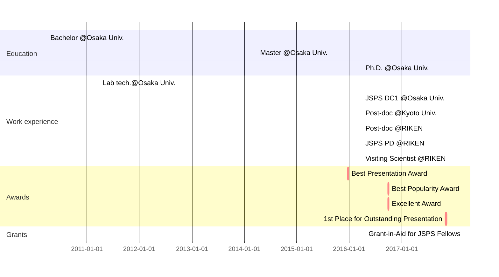

```mermaid
gantt
section Education
  Bachelor @Osaka Univ. : BS, 2010-04-01, 2014-03-25
  Master @Osaka Univ.   : MS, 2014-04-01, 2016-03-28
  Ph.D. @Osaka Univ.    : Ph.D., 2016-04-01, 2019-03-25
section Work experience
  Lab tech.@Osaka Univ.     : done, OU-tech, 2011-04-01, 2012-03-31
  JSPS DC1 @Osaka Univ.     : done, DC1, 2016-04-01, 2019-03-31
  Post-doc @Kyoto Univ.     : done, KU-postdoc, after DC1, 2021-04-30
  Post-doc @RIKEN           : done, RIKEN-postdoc, after KU-postdoc, 2022-03-31
  JSPS PD @RIKEN            : active, PD, after RIKEN-postdoc, 2025-03-31
  Visiting Scientist @RIKEN : active, PD, after RIKEN-postdoc, 2025-03-31
section Publication
  {% for post in site.publications reversed %}
    {% post.abbrev %} : crit, {% post.permalink %}, {% post.date %}, 1w
  {% endfor %}
section Awards
  Best Presentation Award                : crit, aw_1, 2015-12-20, 1w
  Best Popularity Award                  : crit, aw_2, 2016-09-25, 1w
  Excellent Award                        : crit, aw_3, 2016-09-25, 1w
  1st Place for Outstanding Presentation : crit, aw_4, 2017-11-01, 1w
section Grants
  Grant-in-Aid for JSPS Fellows : done, grant_DC1, 2016-04-22, 2019-03-31
```
