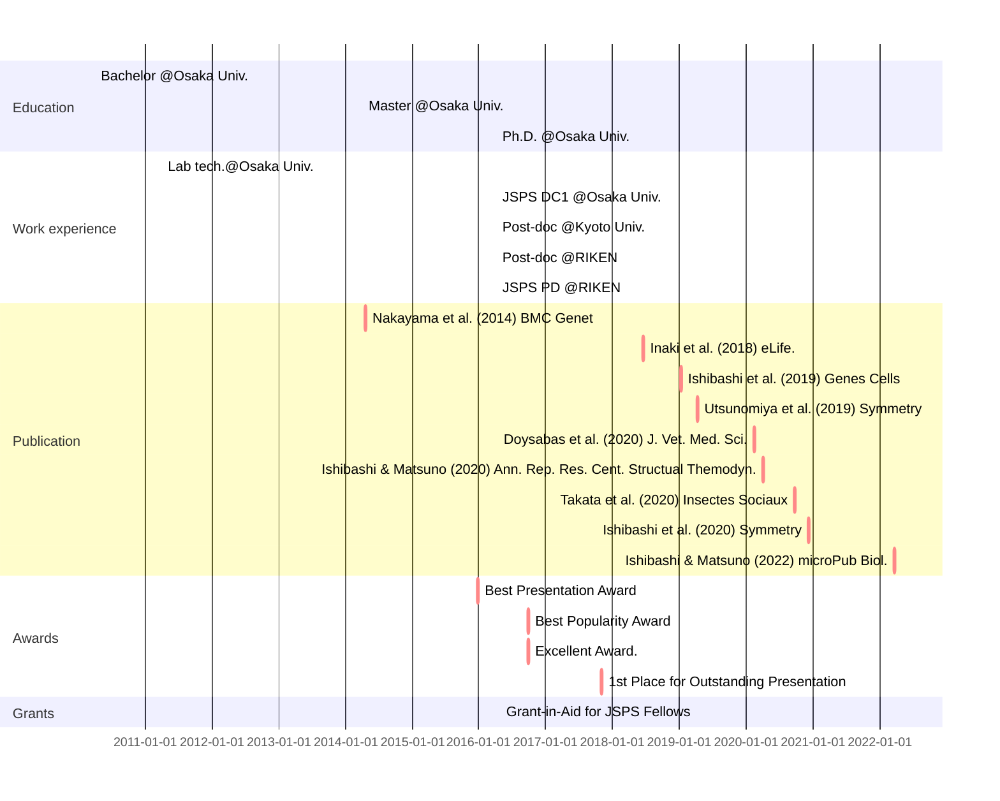





<!--

-->

# Education

- [Ph.D.](../images/学位記.jpg), Department of Biological Sciences, Osaka University, March 25th, 2019
- MS, Department of Biological Sciences, Osaka University, March 28th, 2016
- BS, Department of Biological Sciences, Osaka University, March 25th, 2014

# Work experience

- 2022-Today: Postdoctoral Fellow (PD), Research Fellowship for Young Scientists, JSPS
  - [Laboratory for Physical Biology](http://www.qbic.riken.jp/phb/), RIKEN BDR, Japan.
  - Supervisor: Dr. Tatsuo Shibata

- 2021-2022: Postdoctoral Researcher
  - [Laboratory for Physical Biology](http://www.qbic.riken.jp/phb/), RIKEN BDR, Japan.
  - Supervisor: Dr. Tatsuo Shibata

- 2019-2021: Postdoctoral Researcher
  - [Laboratory of Insect Ecology](http://www.insecteco.kais.kyoto-u.ac.jp/englishpage.html), Faulty of Agriculture, Kyoto University
  - Supervisor: Prof. Kenji Matsuura

- 2016-2019: [Research Fellowship for Young Scientists (DC1), JSPS](https://kaken.nii.ac.jp/en/grant/KAKENHI-PROJECT-16J01027/)
  - [Laboratory of Cell Biology](http://www.bio.sci.osaka-u.ac.jp/bio_web/lab_page/matsuno/Etop.html), Department of Biological Sciences, Osaka University
  - Supervisor: Prof. Kenji Matsuno

- 2011-2012: Lab technician
  - Laboratory of Genome and Chromosome Functions, Institute for Protein Research, Osaka University
  - Supervisor: Prof. Akira Shinohara

# Skills

- Skills in *Drosophila melanogaster*
  - Developmental biology
  - Genetics
  - Cell biology
  - Molecular biology
- Bioinformatics
  - RNA-seq
  - Whole genome sequencing
  - ChIP-seq

# Publications

Total: {{ site.publications | size }}

  <ul>
    
  </ul>

# Awards

Total: {{ site.awards | size }}

  <ul>
    
  </ul>

# Grants

Total: {{ site.grants | size }}

  <ul>
    
  </ul>

# Talks

Total: {{ site.talks | size }}

  <ul>
    
  </ul>

# Teaching

Total: {{ site.teaching | size }}

  <ul>
    
  </ul>
