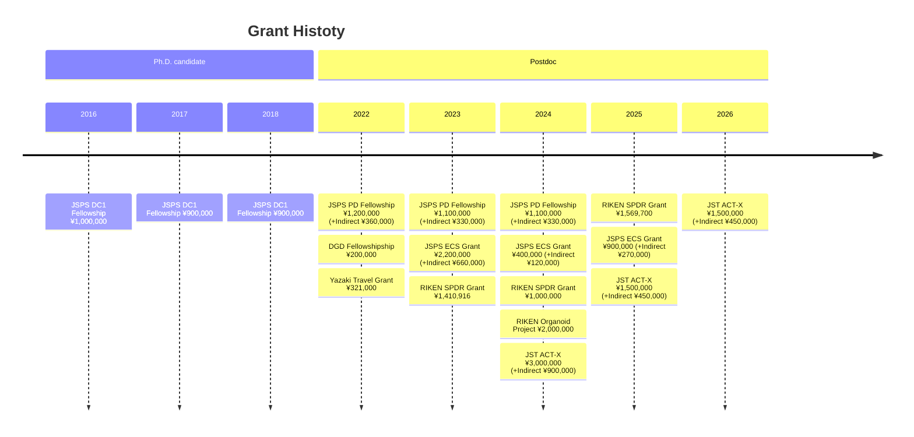
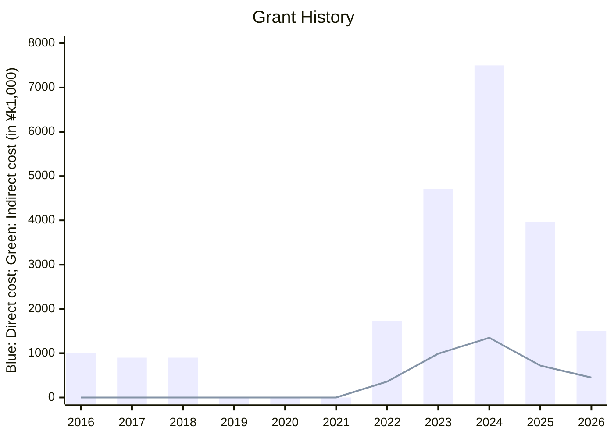

<!--

```mermaid
timeline
    title Grant Histoty
    section Ph.D. candidate
        2016 : JSPS DC1 Fellowship ¥1,000,000
        2017 : JSPS DC1 Fellowship ¥900,000
        2018 : JSPS DC1 Fellowship ¥900,000
    section Postdoc
        2022 : JSPS PD Fellowship ¥1,200,000 (+Indirect ¥360,000)
             : DGD Fellowshipship ¥200,000
             : Yazaki Travel Grant ¥321,000
        2023 : JSPS PD Fellowship ¥1,100,000 (+Indirect ¥330,000)
             : JSPS ECS Grant ¥2,200,000 (+Indirect ¥660,000)
             : RIKEN SPDR Grant ¥1,410,916
        2024 : JSPS PD Fellowship ¥1,100,000 (+Indirect ¥330,000)
             : JSPS ECS Grant ¥400,000 (+Indirect ¥120,000)
             : RIKEN SPDR Grant ¥1,000,000
             : RIKEN Organoid Project ¥2,000,000
             : JST ACT-X ¥3,000,000 (+Indirect ¥900,000)
        2025 : RIKEN SPDR Grant ¥1,569,700
             : JSPS ECS Grant ¥900,000 (+Indirect ¥270,000)
             : JST ACT-X ¥1,500,000 (+Indirect ¥450,000)
        2026 : JST ACT-X ¥1,500,000 (+Indirect ¥450,000)
```

```mermaid
xychart-beta
    title "Grant History"
    x-axis [2016, 2017, 2018, 2019, 2020, 2021, 2022, 2023, 2024, 2025, 2026]
    y-axis "Blue: Direct cost; Green: Indirect cost (in ¥k1,000)" 0 --> 8000
    bar [1000, 900, 900, 0, 0, 0, 1721, 4711, 7500, 3969, 1500]
    line [0, 0, 0, 0, 0, 0, 360, 990, 1350, 720, 450]
```
-->

