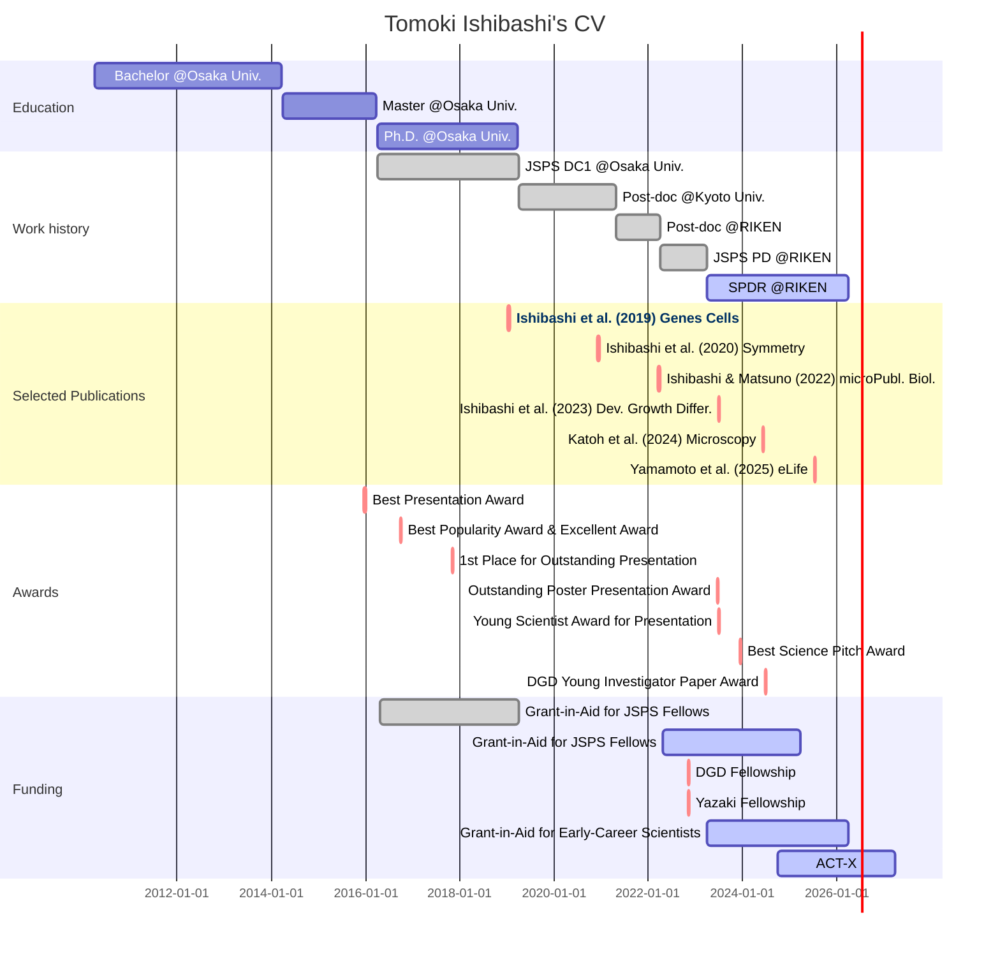



```mermaid
gantt
title Tomoki Ishibashi's CV
dateFormat  YYYY-MM-DD
section Education
  Bachelor @Osaka Univ. : BS, 2010-04-01, 2014-03-25
  Master @Osaka Univ.   : MS, 2014-04-01, 2016-03-28
  Ph.D. @Osaka Univ.    : Ph.D., 2016-04-01, 2019-03-25
section Work history
  JSPS DC1 @Osaka Univ.     : done, DC1, 2016-04-01, 2019-03-31
  Post-doc @Kyoto Univ.     : done, KU-postdoc, after DC1, 2021-04-30
  Post-doc @RIKEN           : done, RIKEN-postdoc, after KU-postdoc, 2022-03-31
  JSPS PD @RIKEN            : done, PD, after RIKEN-postdoc, 2023-03-31
  SPDR @RIKEN               : active, SPDR, after PD, 2026-03-31
section Selected Publications
  Ishibashi et al. (2019) Genes Cells         : crit, ishibashi2019, 2019-01-09, 2w
  Ishibashi et al. (2020) Symmetry            : crit, ishibashi2020b, 2020-12-02, 2w
  Ishibashi & Matsuno (2022) microPubl. Biol. : crit, ishibashi2022, 2022-03-18, 2w
  Ishibashi et al. (2023) Dev. Growth Differ. : crit, ishibashi2023, 2023-06-25, 2w
  Katoh et al. (2024) Microscopy              : crit, katoh2024, 2024-06-01, 2w
  Yamamoto et al. (2025) eLife                : crit, yamamoto2025, 2025-07-08, 2w
section Awards
  Best Presentation Award                  : crit, aw_1, 2015-12-20, 2w
  Best Popularity Award & Excellent Award  : crit, aw_2, 2016-09-25, 2w
  1st Place for Outstanding Presentation   : crit, aw_4, 2017-11-01, 2w
  Outstanding Poster Presentation Award    : crit, aw_5, 2023-06-15, 2w
  Young Scientist Award for Presentation   : crit, aw_6, 2023-06-29, 2w
  Best Science Pitch Award                 : crit, aw_7, 2023-12-08, 2w
  DGD Young Investigator Paper Award       : crit, aw_8, 2024-06-21, 2w
section Funding
  Grant-in-Aid for JSPS Fellows             : done, grant_DC1, 2016-04-22, 2019-03-31
  Grant-in-Aid for JSPS Fellows             : active, grant_PD, 2022-04-22, 2025-03-31
  DGD Fellowship                            : crit, dgd_fellowship, 2022-11-04, 2w
  Yazaki Fellowship                         : crit, yazaki_fellowship, 2022-11-04, 2w
  Grant-in-Aid for Early-Career Scientists  : active, grant_ecs2023, 2023-04-01, 2026-03-31
  ACT-X                                     : active, ACT-X2024, 2024-10-01, 2027-03-31

click ishibashi2019 href "https://onlinelibrary.wiley.com/doi/full/10.1111/gtc.12669"
```
