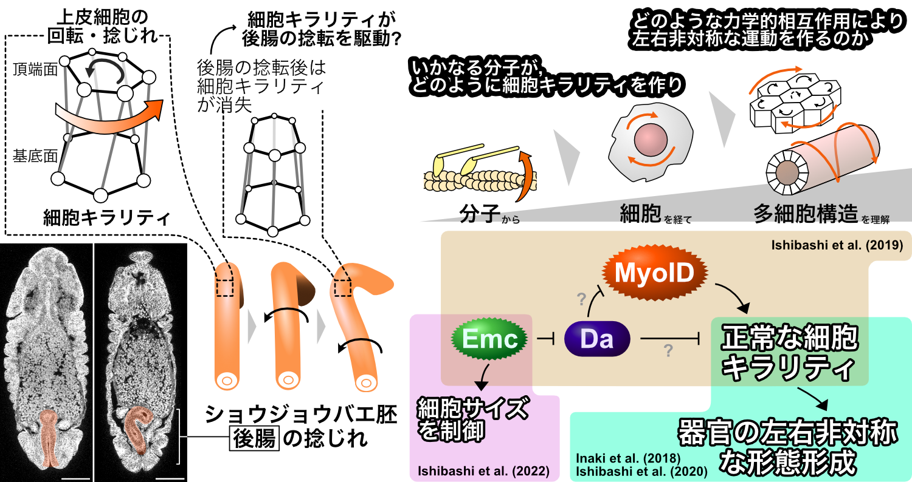

I am interested in Development.

# Left-right asymmetric morphogenesis

- I am elucidating mechanism by which the cell chirality emerges left-right asymmetric morphogenesis at the multi-cellular level by using cultured cell.
- I had studied about LR-asymmetric development by using *Drosphila* embryo.

- [E and ID proteins regulate cell chirality and left–right asymmetric development in *Drosophila*](https://onlinelibrary.wiley.com/doi/full/10.1111/gtc.12669)
- [Statistical Validation Verifies That Enantiomorphic States of Chiral Cells Are Determinant Dictating the Left- or Right-Handed Direction of the Hindgut Rotation in *Drosophila*](https://www.mdpi.com/2073-8994/12/12/1991/htm)
- [*extra macrochaetae*, encoding *Drosophila* Id, controls apical cell shape in the hindgut epithelium](https://doi.org/10.17912/micropub.biology.000526)
- [Chiral cell sliding drives left-right asymmetric organ twisting](https://elifesciences.org/articles/32506)
- [The *Drosophila* AWP1 ortholog Doctor No regulates JAK/STAT signaling for left-right asymmetry in the gut by promoting receptor endocytosis](https://doi.org/10.1101/2022.08.20.504629)
- [Cells with Broken Left–Right Symmetry: Roles of Intrinsic Cell Chirality in Left–Right Asymmetric Epithelial Morphogenesis](https://www.mdpi.com/2073-8994/11/4/505)

# Post-embryonic development, caste differentiation, in termite

I had studied about the molecular mechanism of the caste differentiation by using termites.
Importantly, this is the developmental biology of the **Superorganism**.

- [A non-invasive method for sexing first and second instar larvae of termites using external morphology](http://link.springer.com/article/10.1007/s00040-020-00785-2)
