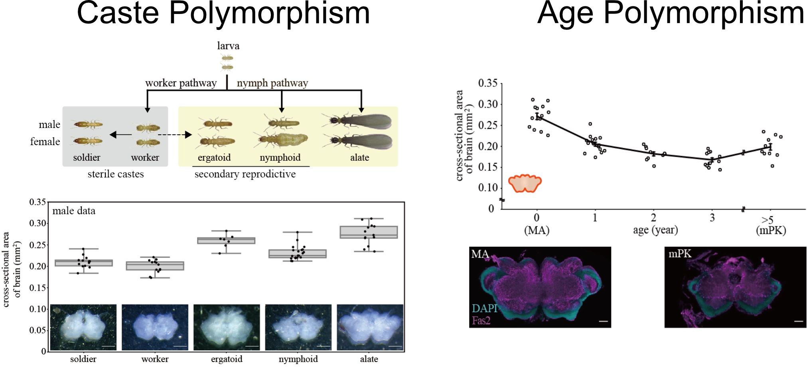

<b>This work was selected as a cover image of DGD!!</b>

## 簡単な解説

本研究は，**シロアリの脳形態がカースト間・年齢間で表現型多型を示す**ことを報告するものです．
特に，単にカースト間で多型が観察されるだけでなく，脳サイズが生殖カーストか否かに相関することを発見した点，すなわち**発生学的な違いよりも社会的な役割の違いの方が脳サイズの違いをうまく説明できる**ということを発見した点が重要だと思っています．  
さらに，**シロアリの王が加齢とともに脳形態を大きく変える**ことも報告しました．
面白いのは，**視覚に関わる脳領域である視葉が年齢とともに萎縮し，それに伴い視覚依存的に物体を避けるというタスク処理能力も大幅に低下している**ことを発見した点です．
この後胚発生プランは，シロアリ王が羽アリとして飛び立ったときには視覚依存的なタスクが存在する一方，木の中でワーカーたちに世話をされながら暮らすようになると視覚依存的なタスクが不要になるという生活環に見事にマッチしているように見えます．

これは，もったいない精神から始まったセレンディップな研究です．
大阪大学 細胞生物学研究室(松野健治 博士 主宰)を卒業した私は，それまで研究してきた細胞生物学や発生学から個体集団スケールの研究に目を向けようと思い，ファーストポスドク先として2019年4月より京都大学 昆虫生態学研究室 (松浦健二 博士 主宰)に加わりました．
この研究でも用いているシロアリ王ですが，この野外採集技術は京都大学 昆虫生態学研究室がほぼ独自に培ったもので，シロアリの王や女王は他の研究室では容易には用いることのできない希少なサンプルです．

当時，昆虫生態学研究室ではシロアリの王が採集されると，写真撮影や大きさの計測といった記載がなされ，いくつかの身体の部位が解剖に回されていました．
研究テーマをどうしようか考えていた私は，そこでシロアリ王の頭部が解剖にも回されず，ただDNA抽出用の「捨て部位」として冷凍保存されていることに気づきました．
どうせ捨てられる部位なので，その希少性にも関わらず，多数のサンプルを集めることができます．
野外採集されたシロアリはほとんど京都大学でしか手に入らないのですから，その脳形態を詳細に調べれば新発見があるに違いありません
(実際，査読者からも野外採集したシロアリ王をこれだけ観たのはすごい，とコメントいただきました)．  
大阪大学で学んできたイメージングと，京都大学で学んだフィールドワーク・行動解析を組み合わせることで，私にしかできない仕事にできたと嬉しく思っています．

<!--
以下はこぼれ話から更にこぼれた話である．

この論文は，机をバンバン叩いたり大声で罵倒・侮辱されたりという，責任著者による恫喝的・暴力的で不適切な対応のもと執筆された．
この恨みは骨髄まで至っている．
論文として特筆すべきは，当該行為を行った責任著者が「お前(筆者)には論文を書く能力が無いから俺が書く」とまで言ってイントロダクションを執筆したにも関わらず，査読者が当該イントロダクションを「無意味である」として一蹴したことである．
結局のところアカデミックで論理的な文章を書く能力が無いのは当該責任著者なのではないかと思われる．
逆に，私が執筆したディスカッションは，「こんなんでは全然ダメ」などと理由も述べずに否定され続けたにも関わらず，気付けばそのまま投稿され，査読者からも特に問題なく受容された．

以上の論文執筆でのやり取りも含んだ，それ以外の研究生活での様々な問題により，私は昆虫生態学研究室を去ることにした．
特に，シロアリの遺伝子組換えという難題の進捗が思うように出ないとき，大声で罵倒されながら「そんなんもできないなら(ラボを)去れ」と必要以上の恫喝行為に及ばれたことが決定的となった．
この件について，「あれは言い過ぎであったし，それ以外にも机を叩いたり大声で罵倒するのをやめてほしい」と直接伝えたが，とくに謝罪もなく有耶無耶にされ，
あまつさえ翌週のラボミーティングで「この間，ポスドクから『指導を甘くしてください』と言われた」などと虚言による言い訳(にもなっていないが)を為された始末である．

上記の解説で，最後に「私にしかできない仕事にできたと嬉しく思っています」と書いたが，元の文章では「誇らしく思っています」と書いていた．
途中で，全く誇らしく思っていないことに気づいたので書き換えた．
恫喝と侮辱で自分の自尊心を高めるような恥ずべき人間との共著論文は，不名誉な論文でもあるためだ．
おそらく，この論文については彼の中で記憶が捏造され，「無能なポスドクの論文を書いてあげた俺」という舞台装置として研究室で語られるのだろう．
彼の研究室を去るとき，彼に関わる人間関係はすべて損切りする覚悟を決めた．
悔しい部分もあるが，この論文も含めた彼の人間性の評価は，私の周囲の人々に任せたいと思う．

もしこの記載を見つけた人がいるならば，ゆめゆめ当該人物と関わるなかれと忠告したい．
ただし，当該人物を除き，昆虫生態学研究室で関わった人々は能力的にも人格的にも優れていたことは書き添えておく．
-->
